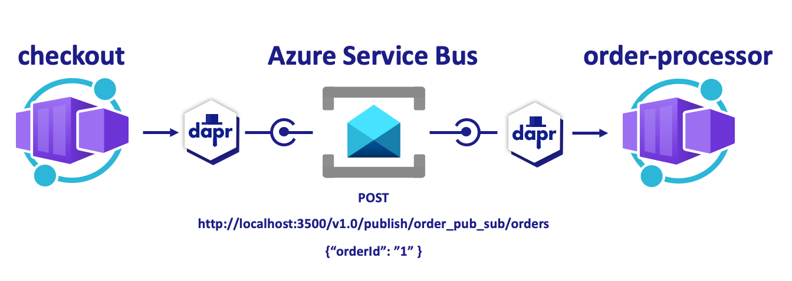

# Microservice communication using pubsub (async)



In this quickstart, you'll create a publisher microservice and a subscriber microservice to demonstrate how Dapr enables a publish-subcribe pattern. The publisher will generate messages of a specific topic, while subscribers will listen for messages of specific topics. See [Why Pub-Sub](#why-pub-sub) to understand when this pattern might be a good choice for your software architecture.

For more details about this quickstart example please see the [Pub-Sub Quickstart documentation](https://docs.dapr.io/getting-started/quickstarts/pubsub-quickstart/).

Visit [this](https://docs.dapr.io/developing-applications/building-blocks/pubsub/) link for more information about Dapr and Pub-Sub.

> **Note:** This example leverages the Dapr client SDK.  If you are looking for the example using only HTTP `requests` [click here](../http).

This quickstart includes one publisher:

- Python client message generator `checkout` 

And one subscriber: 
 
- Python subscriber `order-processor`

### Pre-requisites

For this example, you will need:

- [Dapr CLI](https://docs.dapr.io/getting-started).
- [Python 3.7+](https://www.python.org/downloads/).
<!-- IGNORE_LINKS --> 
- [Docker Desktop](https://www.docker.com/products/docker-desktop)
<!-- END_IGNORE -->

### Run Python message subscriber with Dapr

1. Install dependencies: 

<!-- STEP
name: Install python dependencies
-->

```bash
cd ./order-processor
pip3 install -r requirements.txt 
```

<!-- END_STEP -->

2. Run the Python subscriber app with Dapr: 

<!-- STEP
name: Run python subscriber
expected_stdout_lines:
  - '== APP == Subscriber received : 4'
  - "Exited App successfully"
expected_stderr_lines:
output_match_mode: substring
working_dir: ./order-processor
background: true
sleep: 10
-->

```bash
dapr run --app-id order-processor --components-path ../components/ --app-port 5001 -- python3 app.py
```

<!-- END_STEP -->

### Run Python message publisher with Dapr

3. Install dependencies: 

<!-- STEP
name: Install python dependencies
-->

```bash
cd ./checkout
pip3 install -r requirements.txt 
```
<!-- END_STEP -->

4. Run the Python publisher app with Dapr: 

<!-- STEP
name: Run python publisher
expected_stdout_lines:
  - '== APP == INFO:root:Published data: {"orderId": 1}'
  - '== APP == INFO:root:Published data: {"orderId": 2}'
  - "Exited App successfully"
expected_stderr_lines:
output_match_mode: substring
working_dir: ./checkout
background: true
sleep: 10
-->

```bash
dapr run --app-id checkout --components-path ../components/ -- python3 app.py
```

<!-- END_STEP -->

```bash
dapr stop --app-id checkout
dapr stop --app-id order-processor
```

### Deploy to Azure (Azure Container Apps and Azure Service Bus)

#### Deploy to Azure for dev-test

NOTE: make sure you have Azure Dev CLI pre-reqs [here](https://github.com/Azure-Samples/todo-python-mongo-aca)

5. Run the following command to initialize the project. 

```bash
azd init --template https://github.com/Azure-Samples/pubsub-dapr-python-servicebus
``` 

This command will clone the code to your current folder and prompt you for the following information:

- `Environment Name`: This will be used as a prefix for the resource group that will be created to hold all Azure resources. This name should be unique within your Azure subscription.

6. Run the following command to package a deployable copy of your application, provision the template's infrastructure to Azure and also deploy the application code to those newly provisioned resources.

```bash
azd up
```

This command will prompt you for the following information:
- `Azure Location`: The Azure location where your resources will be deployed.
- `Azure Subscription`: The Azure Subscription where your resources will be deployed.

> NOTE: This may take a while to complete as it executes three commands: `azd package` (packages a deployable copy of your application),`azd provision` (provisions Azure resources), and `azd deploy` (deploys application code). You will see a progress indicator as it packages, provisions and deploys your application.
